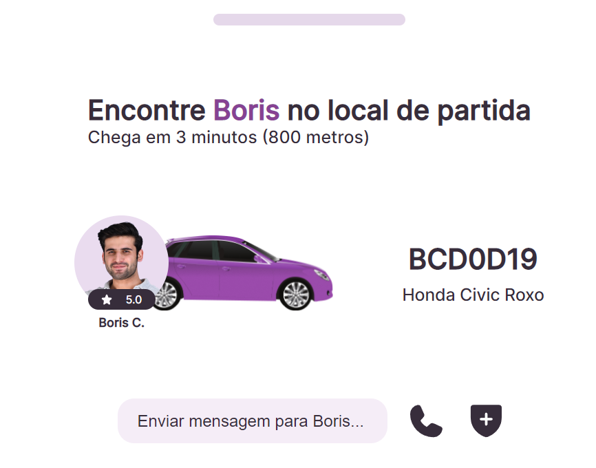

<h1 align="center"> #19 Widget de transporte </h1>

Desafio #19 <a href="https://boracodar.dev/">#BORACODAR</a> da RocketSeat 

  <a href="#-tecnologias">Tecnologias</a>&nbsp;&nbsp;&nbsp;|&nbsp;&nbsp;&nbsp;
  <a href="#-layout">Layout</a>&nbsp;&nbsp;&nbsp;|&nbsp;&nbsp;&nbsp;
  <a href="#-collaborators">Collaborators</a>&nbsp;&nbsp;&nbsp;|&nbsp;&nbsp;&nbsp;

 

## Tecnologias

Esse projeto foi desenvolvido com as seguintes tecnologias:

- HTML
- Typescript
- SCSS
- React

## Projeto

O projeto _Widget de transporte_ foi realizado como parte do desafio #19 do #BORACODAR da RocketSeat.

<h1 align="center">
  Funcionalidades
</h1>

O desafio foi a criação de uma banner de widget como um aplicativo de transporte, o layout proposto está disponível em <a href="#-layout">Layout</a>.

  

